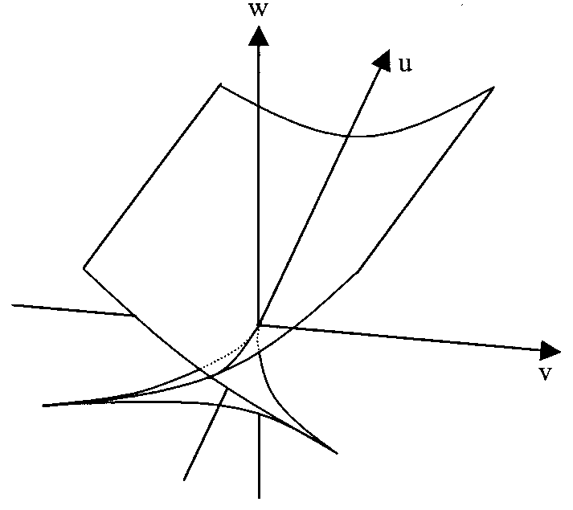
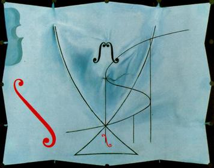

# The Swallowtail Potential of Multiphysics Control

**Thomas Y.L. Lin**

---

## Abstract

We show that the steady state of an electro-thermo-optic device is governed by a one-dimensional reduced potential, and that at a codimension-three degeneracy this potential is locally diffeomorphic to the swallowtail unfolding $V = z^5/5 + az^3/3 + bz^2/2 + cz$. The three physical control knobs, optical power, detuning and electrical heating, are exactly the three parameters required to unfold the singularity. The real roots of $V_z$ then classify every configured system as having zero, one or two stable operating states, and the strata of the catastrophe surface are switching thresholds, endpoints of bistability, and points of zero stability margin. The surface maps where a controlled chip's operating states become fragile or cease to exist.

**Keywords.** Model predictive control, catastrophe theory, co-packaged optics, thermo-optic bistability, normal forms.

---

## Preface

Swallowtail names three things: a butterfly, one of the seven elementary catastrophes in René Thom's classification, and Salvador Dalí's last painting, *The Swallow's Tail* (May 1983), the final work of a series built on Thom. Dalí took the shape from Thom's four-dimensional graph, set it against the cusp, and called catastrophe theory the most beautiful aesthetic theory in the world.

  

  

<i>Papilio machaon</i>  |  the bifurcation set, drawn in $(u,v,w)$ [1], which plays the role of $(a,b,c)$ here  |  Dalí, <i>The Swallow's Tail</i>, 1983

This paper concerns the second of the three. Sections 7 and 8 show that the swallowtail is the normal form of an electro-thermo-optic steady state under three-knob control, and Sections 9 to 11 read its strata as operating regimes.

---

## 1. The multiphysics model

Consider an electro-thermo-optic device. Temperature obeys an energy balance

$$
C_T \frac{d\,\Delta T}{dt}
= P_{\mathrm{elec}}(\Delta T; j)
+ P_{\mathrm{opt}}(\Delta T; p, \delta)
- K\,\Delta T ,
\qquad \Delta T = T - T_0 ,
$$

where $K\Delta T$ is heat removal, $j$ controls electrical heating, $p$ controls optical power and $\delta$ is laser-resonance detuning.

The coupling is circular: temperature shifts both the electrical resistance and the optical resonance, each of which feeds back into dissipation.

$$
T \;\longrightarrow\;
\begin{cases}\text{resistance, leakage}\\ \text{optical resonance}\end{cases}
\;\longrightarrow\;
\begin{cases}P_{\mathrm{elec}}\\ P_{\mathrm{opt}}\end{cases}
\;\longrightarrow\; T .
$$

Throughout we take an Arrhenius-like electrical law and a Lorentzian optical resonance,

$$
P_{\mathrm{elec}} = P_{e0}\, j\, e^{\eta \Delta T},
\qquad
P_{\mathrm{opt}} = \frac{P_{o0}\, p}
{1 + \left(\dfrac{\Delta\omega - \alpha_T \Delta T}{\gamma}\right)^{2}} ,
$$

with $\alpha_T$ the thermo-optic shift coefficient and $\gamma$ the optical linewidth.

---

## 2. Reduced state and steady-state operator

> **Definition 1 (reduced state and controls).** Set $x = \alpha_T \Delta T / \gamma$ and $\delta = \Delta\omega / \gamma$, scale $p$ and $j$ by $K\gamma/\alpha_T$, and write $\beta = \eta\gamma/\alpha_T$, $\tau = C_T / K$ and $u = (p,\delta,j)$.

So $x$ is temperature expressed as a thermo-optic resonance shift in linewidth units.

> **Definition 2 (steady-state operator).**
>
> $$
> G(x; p, \delta, j) \;=\; x \;-\; j e^{\beta x} \;-\; \frac{p}{1 + (\delta - x)^2} .
> $$

> **Lemma 1 (reduced dynamics).** Under Definition 1 the energy balance of Section 1 is equivalent to $\tau \dot{x} = -\,G(x; p, \delta, j)$.

<i>Proof.</i>

Substitute the two constitutive laws of Section 1 into the energy balance,

$$
C_T \frac{d\,\Delta T}{dt}
= P_{e0}\, j\, e^{\eta \Delta T}
+ \frac{P_{o0}\, p}{1 + \left(\frac{\Delta\omega - \alpha_T \Delta T}{\gamma}\right)^{2}}
- K\,\Delta T .
$$

Apply Definition 1: $x = \alpha_T\Delta T/\gamma$, $\delta = \Delta\omega/\gamma$, $\beta = \eta\gamma/\alpha_T$, with $p$ and $j$ scaled by $K\gamma/\alpha_T$. The Lorentzian denominator becomes $1 + (\delta - x)^2$ and the exponent becomes $\beta x$. Dividing through by $K\gamma/\alpha_T$ and writing $\tau = C_T/K$,

$$
\tau \dot x = j e^{\beta x} + \frac{p}{1 + (\delta - x)^2} - x .
$$

The right side is the negative of Definition 2,

$$
\tau\dot x = -\left[\, x - j e^{\beta x} - \frac{p}{1+(\delta-x)^2} \,\right] = -\,G(x; p,\delta,j) .
$$

$\square$

Lemma 1 fixes the dynamics, not only the equilibria.

> **Remark 1 (state space against control space).** A single point of control space is one configured dynamical system $\tau\dot x = -G(x;u)$, whose equilibria are the roots $G(x_i;u)=0$. Control space indexes systems; $x$ indexes operating states within one system. The two are kept separate throughout.

---

## 3. The reduced operating potential

> **Definition 3 (reduced operating potential).** $U(x;u) = \int^{x} G(s;u)\,ds$.

> **Lemma 2 (closed form).** For $G$ as in Definition 2,
>
> $$
> U(x; p, \delta, j) \;=\; \frac{x^2}{2} \;-\; \frac{j}{\beta} e^{\beta x} \;-\; p \arctan(x - \delta) .
> $$

<i>Proof.</i>

By Definition 3, split the integral termwise,

$$
U = \int^{x} G(s;u)\,ds
= \int^{x} s\,ds \;-\; j\int^{x} e^{\beta s}\,ds \;-\; p\int^{x} \frac{ds}{1+(s-\delta)^2} .
$$

Each piece is elementary,

$$
\int^{x} s\,ds = \frac{x^2}{2},
\qquad
\int^{x} e^{\beta s}\,ds = \frac{e^{\beta x}}{\beta},
\qquad
\int^{x} \frac{ds}{1+(s-\delta)^2} = \arctan(x-\delta) .
$$

Collecting the three gives the stated $U$.

$\square$

> **Lemma 3 (gradient flow and descent).** $\tau\dot x = -U_x$, and along any trajectory $dU/dt \le 0$.

<i>Proof.</i>

Definition 3 gives $U_x = G$ directly. Substituting into Lemma 1,

$$
\tau\dot x = -\,G = -\,U_x .
$$

Differentiate $U$ along a trajectory and use that same relation,

$$
\frac{dU}{dt} = U_x\,\dot x = U_x\left(-\frac{U_x}{\tau}\right) = -\frac{1}{\tau}\,U_x^{2} \le 0 ,
$$

with equality exactly at the equilibria.

$\square$

> **Corollary 1 (equilibria and stability).** $U_x = 0$ if and only if $x$ is an equilibrium, and $U_{xx} > 0$ if and only if it is locally stable. Equivalently, stability holds if and only if $G_x > 0$.

<i>Proof.</i>

By Lemma 3 the flow is $\tau\dot x = -U_x$, so $\dot x = 0$ if and only if $U_x = 0$.

Let $x_s$ be such a point and set $\eta = x - x_s$. Linearizing,

$$
\tau\dot\eta = -\,U_{xx}(x_s)\,\eta + O(\eta^2) ,
$$

which decays if and only if $U_{xx}(x_s) > 0$.

Differentiating $U_x = G$ once more gives $U_{xx} = G_x$, so the two stability criteria are the same statement.

$\square$

$U$ is an effective reduced operating potential. It is neither a thermodynamic free energy nor the controller's objective.

> **Figure 1.** $U(x)$ against $x$. Minima labelled *stable operating state*, maxima *unstable*, arrows downhill per $\dot x = -U_x/\tau$. Caption: $U_x = 0$, and $U_{xx} > 0 \Rightarrow$ stable.

---

## 4. The physical fold surface

Differentiating $G$ and writing $y = \delta - x$,

$$
G_x = 1 - \beta j e^{\beta x} - \frac{2py}{(1+y^2)^2} .
$$

A stable and an unstable equilibrium collide when $G = 0$ and $G_x = 0$ hold together.

> **Definition 4 (physical catastrophe set).** $\mathcal{C}_{\mathrm{phys}} = \{ (p,\delta,j) : \exists x,\; G = G_x = 0 \}$.

> **Proposition 1 (fold parametrization).** Let $y = \delta - x$ and suppose $2y \neq \beta(1+y^2)$. Then $G = G_x = 0$ holds if and only if
>
> $$
> p = \frac{(1 - \beta x)(1+y^2)^2}{2y - \beta(1+y^2)},
> \qquad
> j = e^{-\beta x}\left[\, x - \frac{p}{1+y^2} \,\right] .
> $$

<i>Proof.</i>

Write $y = \delta - x$. From $G = 0$,

$$
j e^{\beta x} = x - \frac{p}{1+y^2} ,
$$

which is the stated $j$ after multiplying by $e^{-\beta x}$.

Substitute that same quantity into the second condition,

$$
G_x = 1 - \beta j e^{\beta x} - \frac{2py}{(1+y^2)^2} = 0
\quad\Longrightarrow\quad
1 - \beta\left[\, x - \frac{p}{1+y^2} \,\right] - \frac{2py}{(1+y^2)^2} = 0 .
$$

Multiply through by $(1+y^2)^2$,

$$
(1-\beta x)(1+y^2)^2 + \beta p\,(1+y^2) - 2py = 0 ,
$$

and collect the terms carrying $p$,

$$
p\left[\, 2y - \beta(1+y^2) \,\right] = (1-\beta x)(1+y^2)^2 .
$$

The hypothesis $2y \neq \beta(1+y^2)$ permits division, giving the stated $p$. Conversely, substituting these $p$ and $j$ into $G$ and $G_x$ reverses each step.

$\square$

$\mathcal{C}_{\mathrm{phys}}$ is therefore explicit: it is the set of physical controls at which some equilibrium has zero stability margin.

---

## 5. The degeneracy hierarchy

Continuing to differentiate,

$$
G_{xx} = -\beta^2 j e^{\beta x} + \frac{2p(1 - 3y^2)}{(1+y^2)^3},
\qquad
G_{xxx} = -\beta^3 j e^{\beta x} + \frac{24 p y (1 - y^2)}{(1+y^2)^4} .
$$

> **Definition 5 (degeneracy classes).** A point with $G = G_x = 0$ and $G_{xx} \neq 0$ is a *fold* $(A_2)$; one with $G = G_x = G_{xx} = 0$ and $G_{xxx} \neq 0$ is a *cusp* $(A_3)$; one with $G = G_x = G_{xx} = G_{xxx} = 0$ and $G_{xxxx} \neq 0$ is a *swallowtail* $(A_4)$.

The condition $G_{xxxx} \neq 0$ is what makes the degeneracy stop at fourth order.

---

## 6. Transversality

Degeneracy alone is insufficient: the knobs must independently unfold the three lower-order perturbations.

> **Condition (T).** At the point in question,
>
> $$
> \det \frac{\partial (G, G_x, G_{xx})}{\partial (p, \delta, j)} \neq 0 .
> $$

> **Remark 2.** Condition (T) says the three physical controls move the system independently in the three directions needed to unfold the singularity. It is why a codimension-three catastrophe is reachable by a device with exactly these knobs, and why *multiphysics* control rather than thermal control alone is the relevant regime.

---

## 7. Normal form

> **Theorem 1 (swallowtail potential of multiphysics control).** Let $G$ be as in Definition 2 and suppose that at $(x_*, p_*, \delta_*, j_*)$ the point is an $A_4$ in the sense of Definition 5 and Condition (T) holds. Then there exist a local diffeomorphism
>
> $$
> (x, p, \delta, j) \;\longleftrightarrow\; (z, a, b, c),
> \qquad (x_*, p_*, \delta_*, j_*) \longleftrightarrow (0,0,0,0),
> $$
>
> a nonvanishing $m$ and a positive $\lambda$ such that
>
> $$
> G = m(z,a,b,c)\,( z^4 + a z^2 + b z + c ),
> \qquad
> \dot z = -\lambda(z; a,b,c)\,( z^4 + az^2 + bz + c ) .
> $$

<i>Proof.</i>

By Definition 5 the map $x \mapsto G(x; p_*,\delta_*,j_*)$ satisfies

$$
G = G_x = G_{xx} = G_{xxx} = 0 ,
\qquad G_{xxxx} \neq 0
$$

at $x_*$, which is an $A_4$ singularity. Thom's classification gives a local change of variable $x \leftrightarrow z$ and a nonvanishing $m$ with $G = m\,z^4$ at the critical parameter value.

Condition (T) states

$$
\det \frac{\partial (G, G_x, G_{xx})}{\partial (p, \delta, j)} \neq 0 ,
$$

so the three-parameter family $G(\cdot\,;p,\delta,j)$ is transverse to the orbit of $z^4$ and is a versal unfolding of it. Every versal unfolding of $A_4$ is equivalent to the universal one,

$$
z^4 + az^2 + bz + c ,
$$

under a diffeomorphism of parameter space carrying $(p_*,\delta_*,j_*)$ to $(0,0,0)$.

Composing the two changes of variable gives the stated coordinates and the factorization $G = m(z,a,b,c)\,q(z)$.

For the dynamics, substitute that factorization into Lemma 1 and absorb both $m$ and the Jacobian $\partial z/\partial x$ into a single prefactor,

$$
\dot z = -\lambda\,(z^4 + az^2 + bz + c) ,
\qquad
\lambda = \frac{m}{\tau}\,\frac{\partial z}{\partial x} .
$$

Both factors are nonvanishing near the critical point; choose the orientation of $z$ so that $\lambda > 0$.

$\square$

> **Remark 3.** This is the precise content of $G \sim \partial_z V$ near $A_4$. It does **not** assert $z = x$ or $(a,b,c) = (p,\delta,j)$; they are smooth local coordinates around the critical point.

---

## 8. The swallowtail potential

> **Definition 6 (swallowtail potential).**
>
> $$
> V(z; a,b,c) = \frac{z^5}{5} + \frac{a z^3}{3} + \frac{b z^2}{2} + cz ,
> \qquad q(z) = z^4 + a z^2 + b z + c .
> $$

> **Lemma 4 ($V$ is the normal-form potential).** $V_z = q$; the dynamics of Theorem 1 are $\dot z = -\lambda V_z$ with $dV/dt \le 0$; and $V_z = 0$ characterizes equilibria while $V_{zz} > 0$ characterizes the stable ones.

<i>Proof.</i>

Differentiate Definition 6 term by term,

$$
V_z = \frac{d}{dz}\left[\, \frac{z^5}{5} + \frac{az^3}{3} + \frac{bz^2}{2} + cz \,\right]
= z^4 + az^2 + bz + c = q .
$$

Theorem 1 then reads $\dot z = -\lambda q = -\lambda V_z$, so along a trajectory

$$
\frac{dV}{dt} = V_z\,\dot z = -\lambda\,V_z^{2} \le 0 ,
$$

using $\lambda > 0$.

Equilibria are the zeros of $\dot z$, hence of $V_z$. Linearizing at an equilibrium $z_s$ as in Corollary 1 gives recovery rate $\lambda V_{zz}(z_s)$, positive exactly when $V_{zz}(z_s) > 0$.

$\square$

The controls $(a,b,c)$ reshape the operating landscape.

---

## 9. Classification of configured systems

Fix $(a,b,c)$; this fixes one configured system in the sense of Remark 1.

> **Proposition 2 (root count).** A configuration with only simple roots has $0$, $2$ or $4$ of them.

<i>Proof.</i>

$q$ is a monic quartic, so it has four roots in $\mathbb{C}$ counted with multiplicity, and $q(z) \to +\infty$ as $z \to \pm\infty$.

Its coefficients are real, so non-real roots occur in conjugate pairs and their number is $0$, $2$ or $4$. Subtracting from four leaves

$$
4, \qquad 2, \qquad 0
$$

real roots, and by hypothesis all of them are simple.

$\square$

> **Proposition 3 (monostable).** If $q$ has exactly two simple roots $z_1 < z_2$, then $z_1$ is unstable and $z_2$ is stable, so the configuration has one stable operating state.

<i>Proof.</i>

With exactly two simple real roots, $q$ changes sign at each and nowhere else. Since $q \to +\infty$ at both ends,

$$
q > 0 \ \text{on} \ (-\infty, z_1),
\qquad
q < 0 \ \text{on} \ (z_1, z_2),
\qquad
q > 0 \ \text{on} \ (z_2, \infty) .
$$

A simple root where $q$ passes from $+$ to $-$ has $q_z < 0$, and from $-$ to $+$ has $q_z > 0$, so

$$
q_z(z_1) < 0 , \qquad q_z(z_2) > 0 .
$$

By Lemma 4, $V_{zz} = q_z$, so $z_1$ is unstable and $z_2$ is stable. That leaves one stable operating state.

$\square$

> **Proposition 4 (bistable).** If $q$ has four simple roots $z_1 < z_2 < z_3 < z_4$, they alternate unstable, stable, unstable, stable, so the configuration has two stable operating states.

<i>Proof.</i>

Four simple roots cut the line into five intervals, and $q$ changes sign at each root. With $q \to +\infty$ at both ends the pattern is forced,

$$
+ ,\quad - ,\quad + ,\quad - ,\quad +
$$

Reading the crossings in order,

$$
q_z(z_1) < 0 , \qquad q_z(z_2) > 0 , \qquad q_z(z_3) < 0 , \qquad q_z(z_4) > 0 .
$$

By Lemma 4 the roots alternate unstable, stable, unstable, stable, so $z_2$ and $z_4$ are the two stable operating states.

$\square$

> **Proposition 5 (no local equilibrium).** If $q > 0$ on the neighbourhood, the configuration has no local steady operating state.

<i>Proof.</i>

By Lemma 4 the equilibria are the zeros of $V_z = q$, and the hypothesis $q > 0$ leaves none in the neighbourhood.

The same inequality fixes the direction of the flow,

$$
\dot z = -\lambda\,q < 0 ,
$$

since $\lambda > 0$. The state therefore drifts monotonically out of the neighbourhood.

$\square$

> **Remark 4.** Proposition 5 is local. The global outcome, a distant operating branch or thermal runaway, depends on physics outside the normal form.

> **Figure 2.** Three $V(z)$ panels on a common $z$-axis. **(A)** no roots, $V$ monotonic, *no local steady state*. **(B)** two roots, max then min, labelled $U$, $S$, titled MONOSTABLE. **(C)** four roots, max min max min, labelled $U,S,U,S$, titled BISTABLE. Caption: $0 \to$ none, $2 \to 1S$, $4 \to 2S$.

---

## 10. Strata of the catastrophe surface

> **Proposition 6 (the surface).** The set of $(a,b,c)$ for which $q$ has a repeated root is
>
> $$
> \mathcal{S} = \{\, (a,\; -4z^3 - 2az,\; 3z^4 + az^2) \;:\; z \in \mathbb{R},\; a \in \mathbb{R} \,\} .
> $$

<i>Proof.</i>

A repeated root at $z$ is exactly the pair of conditions $q(z) = q_z(z) = 0$.

The second one determines $b$,

$$
q_z = 4z^3 + 2az + b = 0
\quad\Longrightarrow\quad
b = -4z^3 - 2az .
$$

Substituting that into the first,

$$
c = -z^4 - az^2 - bz
= -z^4 - az^2 + 4z^4 + 2az^2
= 3z^4 + az^2 .
$$

So each pair $(z,a)$ contributes the point $(a,\, -4z^3-2az,\, 3z^4+az^2)$, and conversely every such point satisfies $q(z) = q_z(z) = 0$ by construction. Two free parameters make $\mathcal{S}$ a surface.

$\square$

$\mathcal{S}$ is a two-dimensional surface in three-dimensional control space, and every point of it carries at least one marginal equilibrium.

> **Proposition 7 (cusp locus).** $q$ has a triple root at $z$ if and only if $(a,b,c) = (-6z^2,\, 8z^3,\, -3z^4)$, and there $q(\zeta) = (\zeta - z)^3(\zeta + 3z)$.

<i>Proof.</i>

A triple root at $z$ adds one condition to the two of Proposition 6,

$$
q_{zz} = 12z^2 + 2a = 0
\quad\Longrightarrow\quad
a = -6z^2 .
$$

Feeding that back into Proposition 6,

$$
b = -4z^3 - 2(-6z^2)z = 8z^3 ,
\qquad
c = 3z^4 + (-6z^2)z^2 = -3z^4 .
$$

To confirm the factorization, expand at those parameters,

$$
(\zeta - z)^3(\zeta + 3z)
= (\zeta^3 - 3z\zeta^2 + 3z^2\zeta - z^3)(\zeta + 3z)
= \zeta^4 - 6z^2\zeta^2 + 8z^3\zeta - 3z^4 ,
$$

which is $q(\zeta)$ with $(a,b,c) = (-6z^2,\, 8z^3,\, -3z^4)$. The fourth root is $-3z$, distinct from $z$ unless $z = 0$.

$\square$

> **Proposition 8 (self-intersection).** $q$ has two distinct double roots if and only if $b = 0$, $c = a^2/4$ and $a < 0$, in which case the roots are $z = \pm r$ with $a = -2r^2$.

<i>Proof.</i>

Suppose $q$ has double roots at two distinct points $z_+ \neq z_-$. Counting multiplicity exhausts the quartic, so

$$
q(\zeta) = (\zeta - z_+)^2(\zeta - z_-)^2 .
$$

$q$ has no cubic term, so the coefficient $-2(z_+ + z_-)$ vanishes and $z_- = -z_+$. Write $r = z_+ \neq 0$,

$$
q(\zeta) = (\zeta^2 - r^2)^2 = \zeta^4 - 2r^2\zeta^2 + r^4 .
$$

Matching coefficients,

$$
a = -2r^2 < 0 , \qquad b = 0 , \qquad c = r^4 = \frac{a^2}{4} .
$$

Conversely, given $b = 0$, $c = a^2/4$ and $a < 0$, set $r = \sqrt{-a/2}$; then

$$
q(\zeta) = \zeta^4 + a\zeta^2 + \frac{a^2}{4} = \left(\zeta^2 + \frac{a}{2}\right)^2 = (\zeta^2 - r^2)^2 ,
$$

with double roots at $z = \pm r$.

$\square$

> **Proposition 9 (the $A_4$ point).** $q$ has a quadruple root only at $a = b = c = 0$, where $q(z) = z^4$ and $V(z) = z^5/5$.

<i>Proof.</i>

A quadruple root at $z$ requires $q$ and all three of its derivatives to vanish there. The highest one fixes the location,

$$
q_{zzz} = 24z = 0
\quad\Longrightarrow\quad
z = 0 .
$$

Evaluating the rest at the origin in descending order,

$$
q_{zz}(0) = 2a = 0 ,
\qquad
q_z(0) = b = 0 ,
\qquad
q(0) = c = 0 .
$$

So the origin is the only such point, where $q(z) = z^4$ and, by Definition 6, $V(z) = z^5/5$.

$\square$

The engineering reading of the strata follows.

> **Remark 5 (fold sheet).** At a generic point of $\mathcal{S}$ we have $q_{zz} \neq 0$, so locally $q \sim (z-z_*)^2 + \mu$ and crossing creates or destroys one stable-unstable pair: $R_0 \leftrightarrow R_2$ or $R_2 \leftrightarrow R_4$. There $V_{zz} = 0$, so the stability margin vanishes. This is the switching or state-loss threshold.

> **Remark 6 (cusp edge).** By Proposition 7 three branches coalesce while a fourth is a spectator. In a transverse slice this is where the bistable wedge terminates, so the cusp edge is the organizer of bistability rather than a generic bistable point.

> **Remark 7 (why the textbook cusp shows 1 against 3).** Ignoring the spectator root, the local cusp subsystem exchanges $1 \leftrightarrow 3$ equilibria, which is the familiar picture. Counting all four branches of the $A_4$ normal form gives $2 \leftrightarrow 4$. Both are correct; the fourth root does not participate in the collision.

> **Remark 8 (self-intersection).** By Proposition 8 the same configured system carries two distinct marginal equilibria at $z = \pm r$. A transverse slice has four sectors $R_0, R_2, R_2, R_4$, so it is where the boundaries of two separate state-pair transitions coincide.

> **Remark 9 ($A_4$ is not an operating point).** At the point of Proposition 9 all four branches coalesce, and arbitrarily small control changes alter the number and arrangement of equilibria.

> **Figure 3.** Transverse slice through the self-intersection: two crossing fold lines with sectors $R_2$ above, $R_0$ left, $R_4$ right, $R_2$ below. At the crossing write $q = (z^2 - r^2)^2$ and mark $z = -r$, $z = +r$ as the two marginal states.

---

## 11. Control implication

> **Definition 7 (stability margin).** For an equilibrium $z_s$, $\kappa = V_{zz}(z_s) = q_z(z_s)$.

> **Proposition 10 (critical slowing down).** The linearized recovery rate at $z_s$ is $\lambda(z_s)\kappa$, and it tends to zero as $\mathcal{S}$ is approached.

<i>Proof.</i>

Let $z_s$ be an equilibrium, so $q(z_s) = 0$, and put $z = z_s + \eta$ in $\dot z = -\lambda q$. Expanding both factors about $z_s$,

$$
\dot\eta = -\lambda(z_s + \eta)\,q(z_s + \eta)
= -\lambda(z_s)\left[\, q(z_s) + q_z(z_s)\,\eta \,\right] + O(\eta^2) .
$$

The first bracketed term vanishes, leaving

$$
\dot\eta = -\,\lambda(z_s)\,q_z(z_s)\,\eta + O(\eta^2) ,
$$

so the linearized recovery rate is $\lambda(z_s)\kappa$ with $\kappa = q_z(z_s) = V_{zz}(z_s)$ per Definition 7.

As $(a,b,c)$ approaches $\mathcal{S}$ the equilibrium approaches a repeated root of $q$, where $q_z = 0$ by Proposition 6. Hence $\kappa \to 0$ and the recovery rate vanishes.

$\square$

> **Corollary 2 (usable constraint).** Robust operation in $R_2$ is enforced by
>
> $$
> V_{zz}(z_s) \ge \kappa_{\min} > 0
> \qquad\Longleftrightarrow\qquad
> G_x(x_s; p, \delta, j) \ge g_{\min} > 0 .
> $$

<i>Proof.</i>

By Proposition 10 the recovery rate at $z_s$ is $\lambda(z_s)\kappa$ with $\lambda > 0$, so

$$
V_{zz}(z_s) \ge \kappa_{\min} > 0
$$

bounds that rate away from zero, and by the same proposition keeps the configuration a fixed distance from $\mathcal{S}$.

Theorem 1 supplies a diffeomorphism between $(x,p,\delta,j)$ and $(z,a,b,c)$ under which $V_{zz}$ and $G_x$ agree up to a positive factor, and Corollary 1 identifies $G_x$ as the stability margin in physical coordinates. The normal-form constraint is therefore equivalent to

$$
G_x(x_s; p, \delta, j) \ge g_{\min} > 0 ,
$$

written directly in the device knobs, which is the form the controller can enforce.

$\square$

The controller uses the swallowtail as the map of where operating states become fragile or disappear.

---

## 12. Summary

| Location in $(a,b,c)$ |            Roots of $V_z$ |              Stable states | Configured system                |
| ---------------------- | -------------------------: | -------------------------: | -------------------------------- |
| $R_0$                |                          0 |                          0 | no local operating equilibrium   |
| $R_2$                |                   2 simple |                          1 | **monostable**             |
| $R_4$                |                   4 simple |                          2 | **bistable**               |
| fold sheet             |            one double root | zero margin for that state | switching / state-loss threshold |
| cusp edge              | triple root plus spectator |      higher-order critical | endpoint of bistability          |
| self-intersection      |  two distinct double roots |        two marginal states | two simultaneous marginal states |
| $A_4$ point          |             quadruple root |       maximally degenerate | four branches coalesce           |

The chain, end to end:

$$
C_T \dot{\Delta T} = P_{\mathrm{elec}} + P_{\mathrm{opt}} - P_{\mathrm{cool}}
\;\Rightarrow\;
\tau \dot x = -G
\;\Rightarrow\;
G = U_x,\; \dot U \le 0
\;\Rightarrow\;
A_4
\;\Rightarrow\;
(z,a,b,c)
\;\Rightarrow\;
V_z = z^4 + az^2 + bz + c .
$$

The partition of control space is $R_0$, $R_2$, $R_4$, meaning $0$, $1$, $2$ local stable operating states.

---

## Notes

- $x$ is the thermo-optic shift, the reduced state. $(p,\delta,j)$ are the control knobs. $(z,a,b,c)$ are local normal-form coordinates and are not equal to them.
- $U$ is an effective reduced operating potential, not a free energy and not the controller's cost.
- Theorem 1 applies Thom's classification. The contribution is showing that the electro-thermo-optic steady state admits an $A_4$ point and that the three device knobs satisfy Condition (T).

---

## References

[1] W. G. Weng and W. C. Fan, "An Inspection Criterion for Flashover in Compartment Fires Based on Catastrophe Theory," *Journal of Fire Sciences* **19**(6), 413-427, 2001. DOI: [10.1177/073490401773732427](https://doi.org/10.1177/073490401773732427). Preface figure, centre panel.
